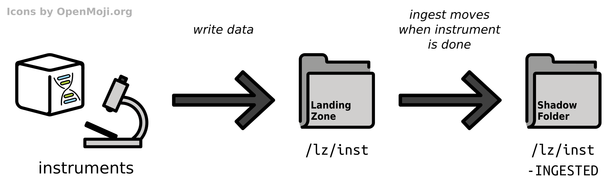

.. _impl_ingest:

===================
Ingest Architecture
===================

**Ingest** is the term used for *importing data into the RODEOS iRODS Server*.
RODEOS uses the iRODS *landing zone* pattern.
The overall process is illustrated in :numref:`fig_ingest_overview`.

.. _fig_ingest_overview:

    Overview of the ingest mechanism from instrument through the landing zone to the corresponding shadow folder.

That is, data is being copied or written into directories that the *ingest software component* has access to.
In most cases, each landing zone folder ``${LZ}`` has a corresponding *shadow folder* ``${LZ}-INGESTED``.
Data items (e.g., files or directories) are written as direct members of ``${LZ}``.
By the presence or content of certain files, the ingest process detects that the data item is complete.
Once the data has been ingested completely and successfully into iRODS, the data item is then moved into the ``${LZ}-INGESTED`` directory.

This allows using so-called machine accounts and/or enabling automatically logging into systems for instruments as common in the labs by creating a landing zone for each instrument and only sharing the ``${LZ}`` folder and not the ``${LZ}-INGESTED`` with the instrument driver computer.
The instrument can only see the data that is currently being written and ingested.
Once complete, the data is moved into a location that it cannot access.

The following sections give an overview and rationales for the import of the supported data types.
Technical details about the ingest steps are described in the `rodeos-ingest <https://rodeos-ingest.readthedocs.io/>`__ software package's documentation.
