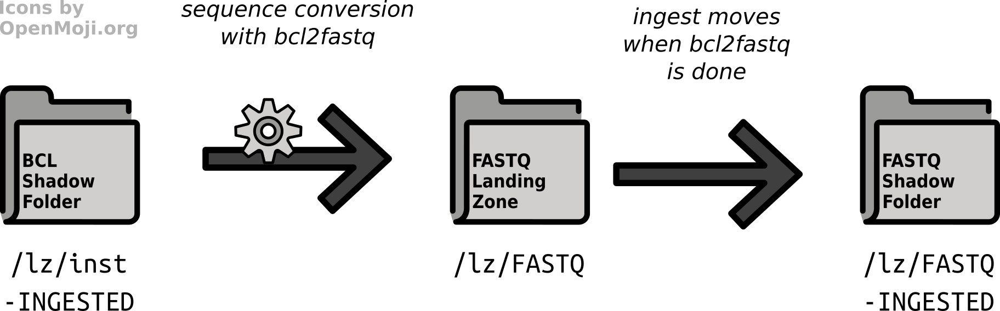

.. _impl_ingest:

===================
Ingest Architecture
===================

**Ingest** is the term used for *importing data into the RODEOS iRODS Server*.
RODEOS uses the iRODS *landing zone* pattern.
The overall process is illustrated in :numref:`fig_ingest_overview`.

.. _fig_ingest_overview:

.. figure:: _static/figures/rodeos-ingest.png
    :alt: overview of the ingest mechanism

    Overview of the ingest mechanism from instrument through the landing zone to the corresponding shadow folder.

That is, data is being copied or written into directories that the *ingest software component* has access to.
In most cases, each landing zone folder ``${LZ}`` has a corresponding *shadow folder* ``${LZ}-INGESTED``.
Data items (e.g., files or directories) are written as direct members of ``${LZ}``.
By the presence or content of certain files, the ingest process detects that the data item is complete.
Once the data has been ingested completely and successfully into iRODS, the data item is then moved into the ``${LZ}-INGESTED`` directory.

This allows using so-called machine accounts and/or enabling automatically logging into systems for instruments as common in the labs by creating a landing zone for each instrument and only sharing the ``${LZ}`` folder and not the ``${LZ}-INGESTED`` with the instrument driver computer.
The instrument can only see the data that is currently being written and ingested.
Once complete, the data is moved into a location that it cannot access.

Multi-step pipelines with multiple ingest can also be implemented.
:numref:`fig_demux_ingest` gives the base call to sequence conversion for genomics facilities as an example.
The sequence conversion software bcl2fastq reads the base call (BCL) files from a disk location that it can access (directly from the shadow directory as shown here or after staging data from the iRODS data store to the local disk).
It writes into a landing zone dedicated to the generation of the sequence FASTQ files.

.. _fig_demux_ingest:

    Overview of the combined process of data processing followed by ingest with sequencing base call to sequence conversion as an example.

Another ingest process runs and transfers the data from the FASTQ landing zone into iRODS.
As for all RODEOS ingest processes, the data is moved into the shadow directory for the FASTQ landing zone once complete.

Note that the ingest process is regularly running with at most one process at a given time.
The ingest is implemented in a "updating" fashion similar to ``rsync`` (technically commonly referred to as being "idempotent") which means that incomplete transfers are continued in the next ingest cycle until complete.

Limitations of the ingest process include the following (the list will be updated as the authors are getting aware of more limitations).

1. In the case that an instrument does not complete (e.g., power loss or component defects), human -intervention is required to decide further actions and remove the partially written data if needed.
2. It is expected that the pause between two instruments runs (e.g., needed for a cleaning step in the lab) is sufficient to ingest data before the next instrument run.
   In the case that the run is started before the previous ingest step is complete, the not yet ingested data set will remain in the landing zone.
   The operator has to take measure to ensure that no data is overwritten.

   It is common for instruments to write to a storage location where data is not moved automatically, and distinct output folder or file names are usually used for each run (e.g., incorporating the insturment ID and run number).
   It is thus not expected that this limitation is neglegible.

The following sections give an overview and rationales for the import of the supported data types.
Technical details about the ingest steps are described in the `rodeos-ingest <https://rodeos-ingest.readthedocs.io/>`__ software package's documentation.
