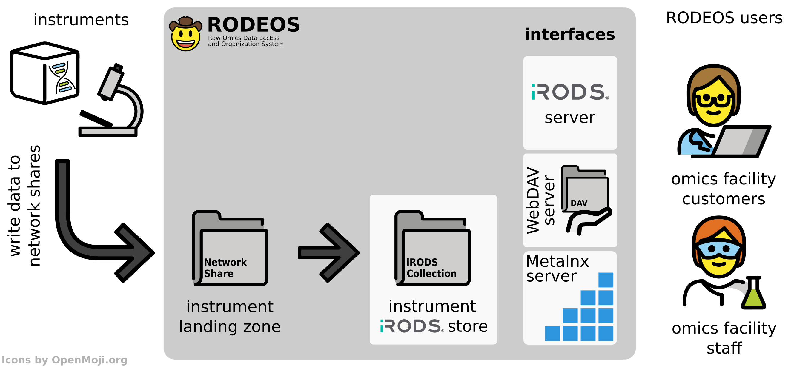

.. _overview:

========
Overview
========

This section gives an overview of the RODEOS system independent from the particular use case and supported omics data type.
:numref:`fig_rodeos_overview` illustrates the overview.
The central component for data and meta data storage is the RODEOS iRODS server.
iRODS allows to store data in a file directory tree and also annotate folders (called *collections* in iRODS) and files (called *data objects* in iRODS) with arbitrary meta data.

.. _fig_rodeos_overview:

    An overview of the RODEOS system.
    Instruments write their data to a network share (*landing zone*).
    The data is then imported (*ingested*) into the RODEOS iRODS server.
    Facility staff can use several interfaces to manage and share the data to facility customers that can use different interfaces to access the data.

Instruments and other data generation processes (such as automated data post processing steps) write the data to a particular folder for the given instrument on network file shares (so-called *landing zones*).
These landing zones are monitored by automated import (so-called *ingest*) processes.
The ingest processes copies the data into the appropriate collection in the iRODS server for this instrument.

RODEOS provides different interfaces to the data in the iRODS system.

iRODS Server
    Users can connect directly to the iRODS server with native iRODS command line tools and client libraries.
    This facilitates automated data download or manipulation with scripts on the command line for power users.
WebDAV Server
    The data is also exposed through a WebDAV server.
    The WebDAV protocol is supported by many graphical clients and operating systems.
    This allows users for graphical access to their data.
Metalnx Server
    Metalnx is a web-based graphical tool for accessing iRODS server functionality.
    This server provides omics facility staff with the required data management tools.
    While not directly aimed at them, facility customers can also use Metalnx functionality for accessing data that has been shared with them.

The RODEOS users are omics facility staff and omics facility customers.
Omics facility staff can then use the interfaces provided by RODEOS to manage the data.
This includes commonly used file and folder operations such as moving files.
They can also curate meta data for data.
Further, they can share data with other users for data delivery.

Omics facility customers can also use the provided interfaces to obtain the data that has been shared with them.
